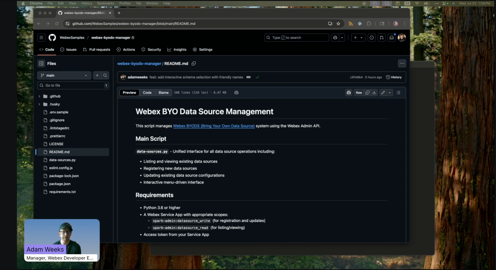

# Webex BYO Data Source Management

[](LICENSE)

This script manages [Webex BYODS (Bring Your Own Data Source)](https://developer.webex.com/create/docs/bring-your-own-datasource) system using the Webex Admin API.

## Vidcast

[
Watch the Vidcast of this app](https://app.vidcast.io/share/63e954e4-f0ae-4c20-82c3-c666cda6aad3?playerMode=vidcast)

## Main Script

**`data-sources.py`** - Unified interface for all data source operations including:

- Listing and viewing existing data sources
- Registering new data sources
- Updating existing data source configurations
- **Quick token extension without configuration changes**
- Interactive menu-driven interface

**`extend_data_source.py`** - Standalone script for quick token extension:

- Extends data source tokens with minimal user interaction
- Automatically generates new nonce (no input required)
- Preserves all existing configuration values
- Configurable token lifetime
- Command-line automation friendly

## Token Management

This project includes automated token refresh functionality to handle service app token expiration:

**Files:**

- **`token_manager.py`** - Core token management class with smart refresh logic
- **`refresh_token.py`** - Standalone script for manual token refresh
- **`TOKEN_MANAGEMENT.md`** - Complete setup and usage documentation

**Key Features:**

- **Smart refresh strategy**: Uses refresh tokens when available, falls back to personal access tokens
- **Real-time token management**: Automatically detects and handles token expiration during API operations
- **Seamless retry mechanism**: Automatically retries failed requests after successful token refresh
- **OAuth support**: Automatic refresh of personal access tokens via OAuth (optional)
- **Automatic validation**: Checks token validity before operations
- **Zero-downtime integration**: Eliminates 401 errors without user intervention
- **Multiple setup options**: Portal tokens, integration tokens, or full OAuth automation

**Test Credentials:**

```bash
# Activate virtual environment
source venv/bin/activate

# Test fetching a fresh service app token
python refresh_token.py

# Set up OAuth for automatic personal token refresh (optional)
python setup_oauth.py
```

For complete setup instructions, see [TOKEN_MANAGEMENT.md](TOKEN_MANAGEMENT.md).

## Requirements

- Python 3.6 or higher
- **A Webex Service App** with appropriate scopes:
  - `spark-admin:datasource_write` (for registration and updates)
  - `spark-admin:datasource_read` (for listing/viewing)
- **Authentication credentials** to request service app tokens (choose one):
  - **Option A (Quick Start)**: Personal Access Token from [developer.webex.com](https://developer.webex.com) (expires every 12 hours)
  - **Option B (Production)**: Integration with `spark:applications_token` scope for OAuth-based refresh

## Setup

1. Create and activate a virtual environment (recommended):

   ```bash
   python3 -m venv venv
   source venv/bin/activate  # On Windows: venv\Scripts\activate
   ```

2. Install the required dependencies:

   ```bash
   pip install -r requirements.txt
   ```

3. Configure your credentials:

   - Copy the token configuration template: `cp token-config.json.template token-config.json`
   - Edit `token-config.json` with your service app and token manager credentials
   - Tokens are fetched fresh each time (not stored)

4. **Recommended**: Set up automated token refresh (for production use):
   - Copy the token configuration template: `cp token-config.json.template token-config.json`
   - Edit `token-config.json` with your service app and token manager credentials
   - See [TOKEN_MANAGEMENT.md](TOKEN_MANAGEMENT.md) for detailed setup instructions

## Usage

Run the data source manager:

```bash
python data-sources.py
```

**Features:**

- Automatically loads and displays all your data sources on startup
- **Advanced automated token refresh**:
  - Automatically refreshes expired service app tokens at startup
  - **Real-time token refresh**: Detects 401 errors during API operations and automatically refreshes tokens
  - **Seamless retry**: Automatically retries failed requests after successful token refresh
  - **Zero-downtime operation**: No manual intervention required when tokens expire
- Interactive menu to view/update existing data sources or register new ones
- **Schema-aware interface**: Automatically fetches and displays available schemas with friendly service type names
- Real-time refresh capability
- Unified interface for all operations
- Saves operation records automatically
- JWT token decoding for enhanced data source details

**Menu Options:**

1. **View/Update Data Sources**: Select any data source to view details and optionally update
2. **Register New Data Source**: Create a new data source with guided prompts
3. **Quick Extend Token (No Config Changes)**: Quickly extend a data source token without changing any configuration values
4. **Refresh Data Sources List**: Reload the current list from the API
5. **Quit**: Exit the application

## Quick Token Extension

**Quick Extend Token** option provides a fast way to extend data source tokens without modifying any configuration:

- **Automatically generates a new nonce** (no user input required)
- **Preserves all existing configuration** (audience, subject, URL, schema, status)
- **Configurable token lifetime** (default: 24 hours, customizable)
- **No interruption to data source operation**
- **Saves operation logs** for audit trail

### Standalone Script

For automation or command-line usage:

```bash
# Extend token with default 24-hour lifetime
python extend_data_source.py <data_source_id>

# Extend token with custom lifetime (e.g., 12 hours = 720 minutes, max 1440)
python extend_data_source.py <data_source_id> 720

# Examples:
python extend_data_source.py 85895e47-3096-4c47-aae8-f5a52f7b7870
python extend_data_source.py 85895e47-3096-4c47-aae8-f5a52f7b7870 720  # 12 hours
```

**Automatic Features:**

- Validates service app token and auto-refreshes if expired
- **Automatic retry on token expiration**: Detects 401 errors and refreshes tokens in real-time
- Extracts current configuration from JWT token
- Creates operation log files automatically
- Shows token expiry time and lifetime details

**Optional Flags:**

```bash
# Save the initial data sources list to a JSON file
python data-sources.py --save-list
```

### Registration Process

When registering a new data source, the script will prompt for:

- **Audience**: The audience field in the JWT token (default: "BYODS")
- **Nonce**: Unique nonce used in the encryption of the JWT token (default: auto-generated UUID)
- **Schema Selection**: Interactive menu showing available schemas with service type names and descriptions (default schema provided)
- **Subject**: The subject field in the JWT token (default: "BYODS")
- **URL**: The URL of the endpoint where Webex will send the data (required, no default)
- **Token Lifetime Minutes**: The validity of the created token in minutes (default: 1440, max 1440)

**Note**: You can press Enter to accept the default values shown in brackets, or type a custom value to override the defaults.

### Update Process

When updating data sources, the process:

- Pre-fills current values as defaults (press Enter to keep)
- **Shows current schema with friendly service type name**
- Requires a new nonce for security (auto-generated UUID provided)
- Allows updating token lifetime, URL, audience, subject, schema selection, and status
- **Interactive schema selection** with numbered menu of available options
- Confirms changes before applying
- Saves operation records to JSON files automatically

## AWS Lambda Deployment (Automated Cloud Execution)

For production use cases requiring fully automated token refresh without manual intervention, you can deploy this solution as an AWS Lambda function that runs on a scheduled basis.

### Why Use AWS Lambda?

- **Fully automated**: No server management required
- **Scheduled execution**: Runs hourly (or custom schedule) to keep tokens fresh
- **Cost-effective**: ~$0.41/month for hourly execution
- **Reliable**: AWS handles infrastructure, monitoring, and scaling
- **Secure**: Credentials stored in AWS Secrets Manager with encryption

### Quick Start

1. **Package the Lambda function:**

   ```bash
   cd deploy
   chmod +x package_lambda.sh
   ./package_lambda.sh
   ```

   This creates `lambda_deployment.zip` with all dependencies.

2. **Deploy to AWS:**

   Follow the step-by-step guide: **[`deploy/AWS_SETUP.md`](deploy/AWS_SETUP.md)**

   The guide covers:

   - **OAuth setup** (REQUIRED for automated operation)
   - Creating AWS Secrets Manager secret
   - Setting up IAM roles and policies
   - Creating and configuring Lambda function
   - EventBridge scheduled triggers
   - Testing and monitoring setup

### Architecture Overview

```text
EventBridge (Hourly Trigger)
    ↓
Lambda Function
    ↓
AWS Secrets Manager ← Read credentials
    ↓                 ← Update tokens
Webex API ← Extend data source token
```

### Key Features

- **Automatic token refresh**: Lambda validates and refreshes service app tokens before extending data source tokens
- **Secrets management**: All credentials securely stored in AWS Secrets Manager
- **Error handling**: Comprehensive logging to CloudWatch for troubleshooting
- **Cost optimization**: Efficient execution (typically 1-3 seconds) keeps costs minimal
- **Monitoring**: Built-in CloudWatch metrics and logs for visibility

### Local vs. Lambda Execution

The `TokenManager` class automatically detects its environment:

- **Local execution**: Uses `token-config.json` for all credentials and tokens
- **Lambda execution**: Uses AWS Secrets Manager for all credentials and tokens

This means the same code works in both environments without modification.

### Monitoring and Troubleshooting

**CloudWatch Logs**: View detailed execution logs for each run

**CloudWatch Metrics**: Track invocations, errors, duration

**Common Issues**: See [`deploy/AWS_SETUP.md`](deploy/AWS_SETUP.md#troubleshooting) for solutions

### Cost Estimate

Monthly AWS costs (approximate):

- Lambda: $0.00 (within free tier for 720 invocations/month)
- Secrets Manager: $0.40/month
- CloudWatch Logs: $0.01/month
- **Total: ~$0.41/month**

### Complete Documentation

For detailed setup instructions, configuration options, and troubleshooting:

**[AWS Lambda Deployment Guide →](deploy/AWS_SETUP.md)**

## Documentation and Resources

### Comprehensive BYODS Guide

- [Bring Your Own Data Source - Complete Developer Guide](https://developer.webex.com/create/docs/bring-your-own-datasource) - Comprehensive guide covering the entire BYODS framework

### Getting Started

- [Service Apps Guide](https://developer.webex.com/docs/service-apps) - Learn how to create and configure Service Apps
- [Webex Developer Portal](https://developer.webex.com/) - Create your Service App here
- [Developer Sandbox Guide](https://developer.webex.com/docs/developer-sandbox-guide) - Set up a sandbox environment for testing
- [Contact Center Sandbox](https://developer.webex-cx.com/sandbox) - For Contact Center specific use cases

### API Documentation

- [Register a Data Source](https://developer.webex.com/admin/docs/api/v1/data-sources/register-a-data-source)
- [Retrieve All Data Sources](https://developer.webex.com/admin/docs/api/v1/data-sources/retrieve-all-data-sources)
- [Retrieve Data Source Details](https://developer.webex.com/admin/docs/api/v1/data-sources/retrieve-data-source-details)
- [Update a Data Source](https://developer.webex.com/admin/docs/api/v1/data-sources/update-a-data-source)
- [Retrieve Data Source Schemas](https://developer.webex.com/admin/docs/api/v1/data-sources/retrieve-data-source-schemas) - Browse available schemas with service types and descriptions

### Security and Authentication

- [JWT Debugger](https://jwt.io) - Tool for inspecting JWS tokens
- [JWS Token Verification Example (Java)](https://github.com/ralfschiffert/byodsJws) - Reference implementation for token validation
- [Cisco Public Key Endpoints](https://idbroker.webex.com/idb/oauth2/v2/keys/verificationjwk/) - US endpoint for JWS verification
- [EU Public Key Endpoint](https://idbroker-eu.webex.com/idb/oauth2/v2/keys/verificationjwk) - EU endpoint for JWS verification

## Response and Output

Upon successful operations, you'll receive:

- Data Source ID (for registrations)
- Status (active/disabled)
- All configured parameters
- Any error messages (if applicable)
- Enhanced JWT token information (audience, subject, expiration)

The script automatically saves all operation details to JSON files:

- **Successful registrations**: `data_source_registration_{ID}_{timestamp}.json`
- **Successful updates**: `data_source_update_{ID}_{timestamp}.json`
- **Failed operations**: `data_source_{operation}_failed_{timestamp}.json`
- **Data source lists**: `data_sources_list_{timestamp}.json` (when using --save-list flag)
- **Token configuration**: `token-config.json` (if using automated token refresh)

These files contain:

- Operation timestamp
- Original configuration used
- Complete API response
- Success/failure status

**Note**: All JSON files are automatically excluded from git via `.gitignore` to protect sensitive information.

## Authentication

The script requires a Service App access token with the following scopes:

- **Registration and Updates**: `spark-admin:datasource_write`
- **Listing/Viewing**: `spark-admin:datasource_read`

For full functionality, use a token that has both read and write scopes.

**Token Management:**

- Service app tokens are automatically refreshed when they expire
- Refresh tokens are stored and used for efficient token renewal
- Manual token refresh available via `python refresh_token.py`
- See [TOKEN_MANAGEMENT.md](TOKEN_MANAGEMENT.md) for configuration details

## Error Handling

The script includes comprehensive error handling for:

- Missing or invalid access tokens
- Network connection issues
- API validation errors
- Invalid input parameters
